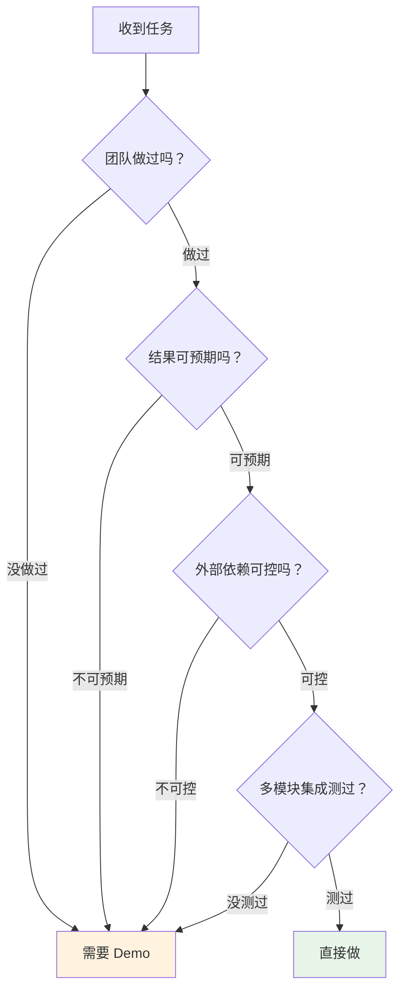
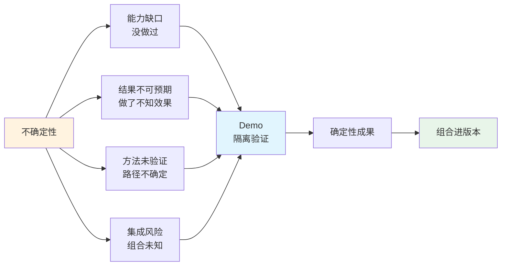
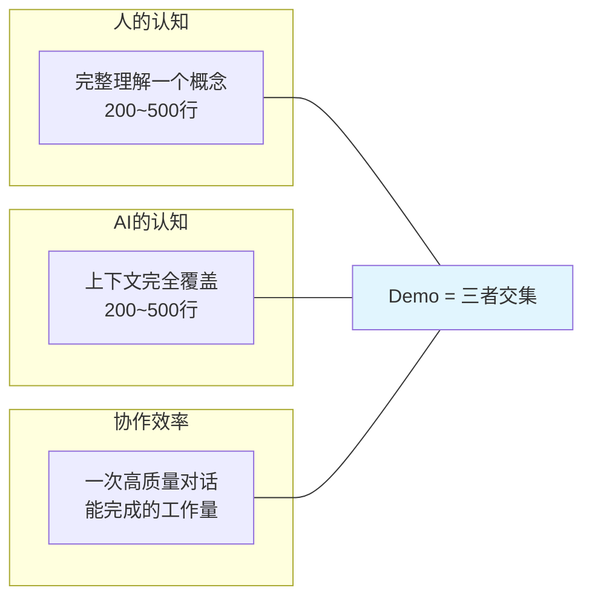
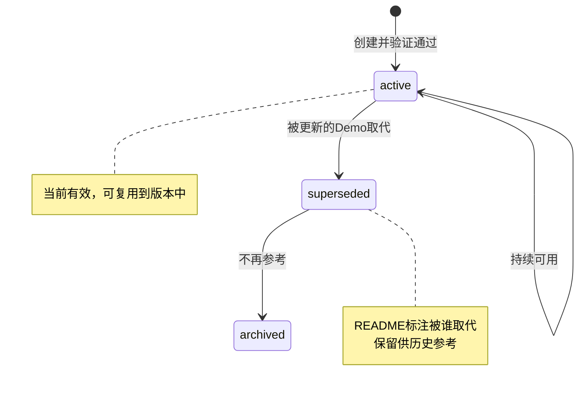
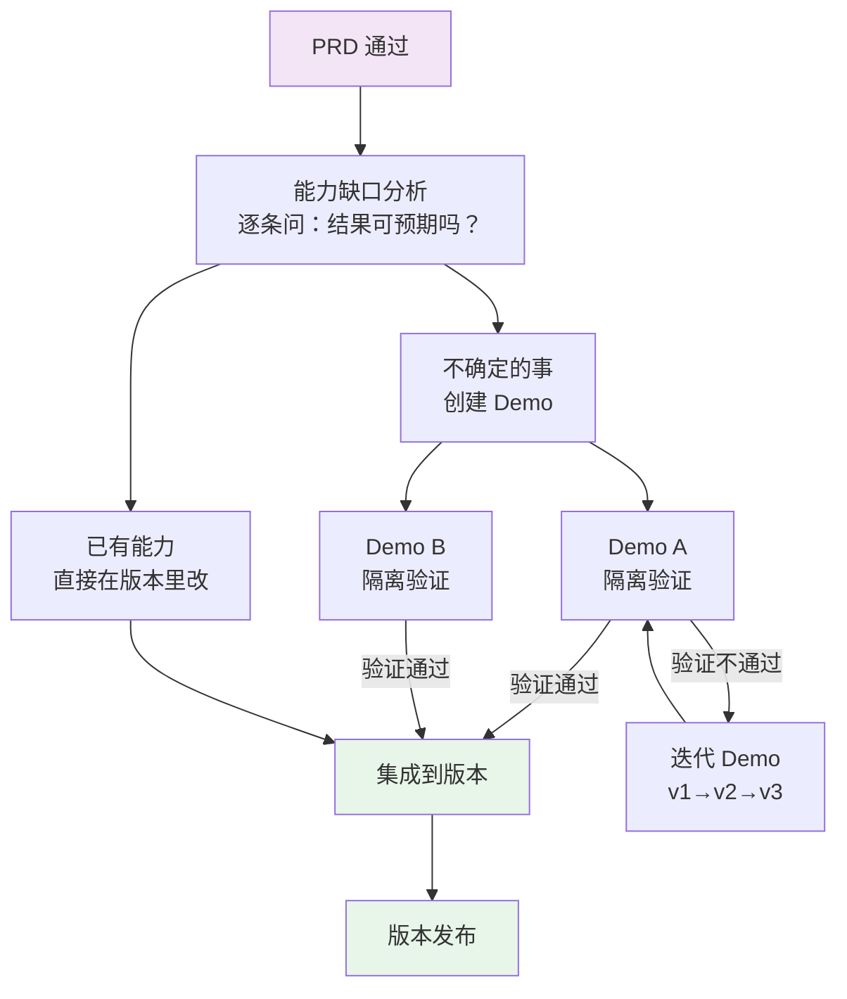
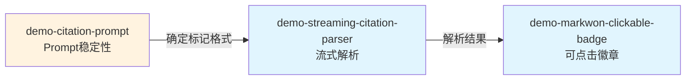
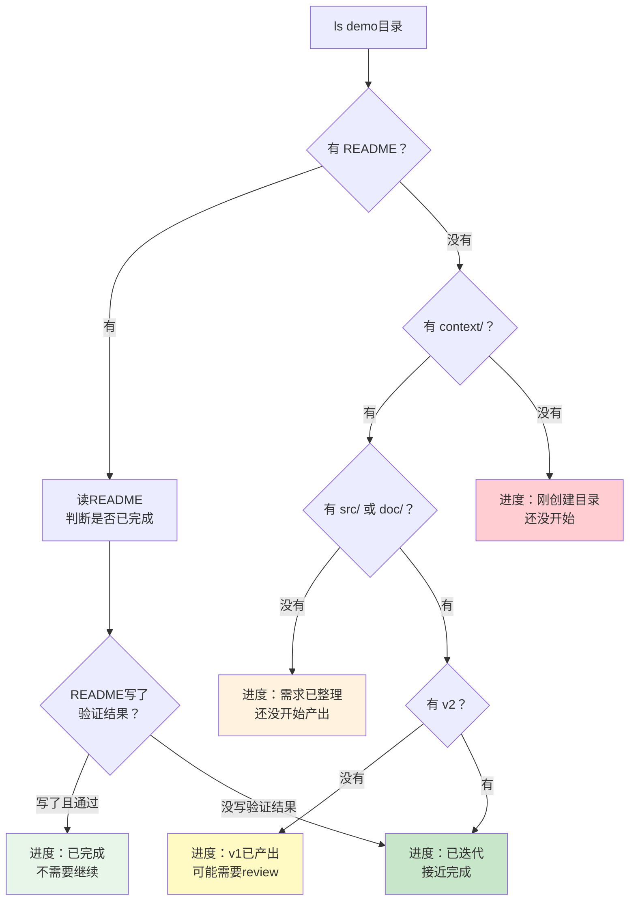
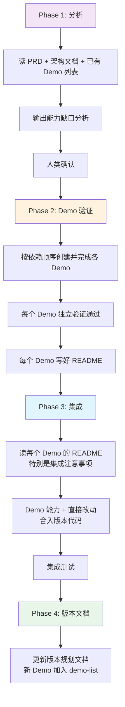
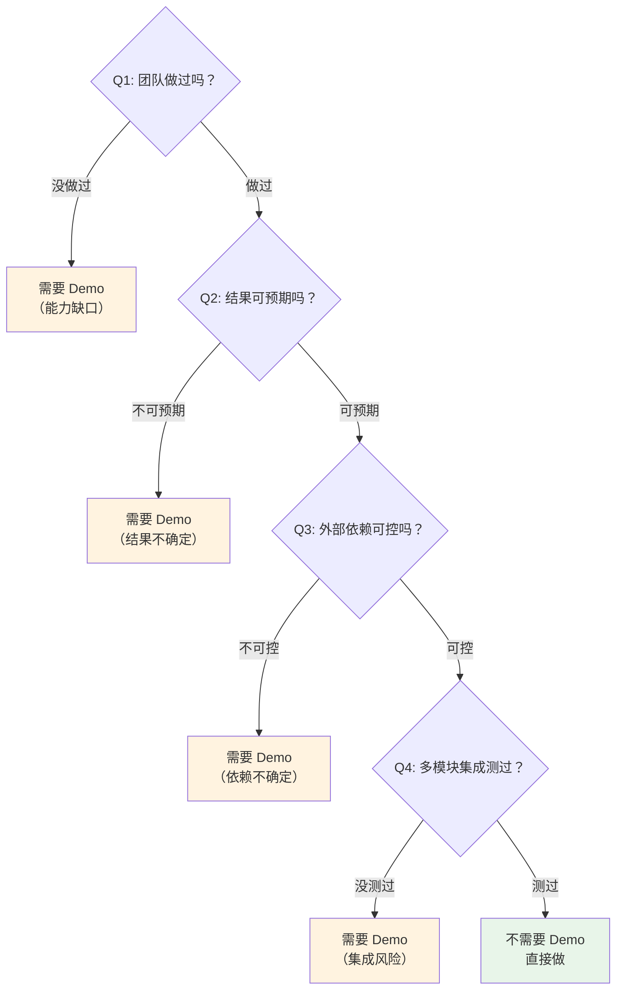

# Demo 驱动的体系化工作方法论

> **核心命题**：Demo 是人与 AI 之间的认知握手协议——将不确定性隔离在可控范围内验证，再将确定性成果组合进版本
> **读者**：AI 协作伙伴（你自己）——本文档教你如何通过 Demo 流程与人类高效协作
> **版本**：v1.0 | by Sunny 和他的 AI
> **更新时间**：2026-02-21

---

# 速查（新会话优先读这里，30行恢复方法论认知）

> - **核心**：Demo = 把不确定的事隔离验证，确定后组合进版本
> - **判断标准**：做了之后结果可预期吗？可预期→直接做。不可预期→先Demo
> - **大小**：200-500行代码 / 一套完整方案
> - **结构**：`context/`(输入) + `src/`|`doc/`(产出) + `README.md`(记忆)
> - **README必写**：解决什么 / 核心方案 / 验证结果 / 已知限制 / 集成注意 / 踩过的坑
> - **命名**：`demo-{能力关键词}`，用 kebab-case，名字即说明

**判断矩阵**：



**主动建议时机**：当人类说"帮我做X"，先默默过判断矩阵。如果结果是"需要Demo"，不要直接做，先建议隔离验证。

---

# 序章：暂停，感受差异

人类说："帮我做一个 AI 对话系统，要支持数据库、消息管理、工具调用、流式对话。"

**方案 A：一口气做**

你作为 AI，开始在一个巨大的项目里写代码。写了数据库连接，写了消息管理，写了工具调用框架，写了 SSE 流式推送……

两千行代码写完了。人类说："跑一下试试。"

跑不起来。数据库连接写法和消息管理的查询不兼容。工具调用框架的错误处理和流式推送的管道冲突。你开始调试——但你需要同时理解四个子系统的交互才能定位问题。

人类说："算了，我们换个方向，工具调用不用这种模式了。"

你刚写的一千行工具调用代码报废了。连带依赖它的流式推送代码也要重写。

**方案 B：拆成 Demo**

```
demo-postgres-connection:   先把数据库连上，能存能取       → 200行，独立运行验证 ✅
demo-message-crud:          再做消息管理，增删改查         → 300行，独立运行验证 ✅
demo-capability-registry:   做工具注册中心，能注册能查询   → 250行，独立运行验证 ✅
demo-tool-execution:        做工具调用引擎                 → 300行，独立运行验证 ✅
demo-conversation-brain:    组合以上，做完整的对话大脑     → 像搭积木一样组合 ✅
```

人类说："工具调用换个模式。" 你只需要重做 demo-tool-execution。其他三个 Demo 不受影响。

**暂停。两种方案你都能执行。方案 A 甚至更直接。那方案 B 的意义是什么？**

不是效率问题。是**你作为 AI 的认知限制决定了方案 B 是唯一可靠的方式**。

你的上下文窗口有限。两千行代码塞进来，你会丢失细节、混淆模块边界、产出不可靠的修改。但 200-500 行的 Demo？你能完整理解每一行，产出高质量的代码。

你没有跨会话记忆。上次对话里讨论的架构决策、踩过的坑，新会话里全部丢失。但 Demo 的 README 就是你的外部记忆——读到它，你在几秒内恢复上下文。

**Demo 不是项目管理方法。是你和人类之间的认知协议。**

---

# 第一章：一个核心洞见

## 1.1 从一个漏判说起

人类要给 AI 对话系统加一个"会议引用"功能——AI 回复时标注信息来源于哪场会议。

你分析了 PRD，列出了 8 件要做的事，逐条判断需不需要 Demo：

```
修改 system_prompt.md，加引用指令 → "会做，改文本而已" → 不需要 Demo
```

人类纠正你："Prompt 也需要一个 Demo，因为需要测试 Prompt 的稳定性。"

你漏判了。为什么？

因为你用了一个**不完整的判断标准**：

```
❌ 旧标准："这件事，会不会做？"
   改 Prompt → 会写 Markdown → "会做" → 不需要 Demo

✅ 正确标准："做了之后，结果是可预期的吗？"
   改 Prompt → LLM 会不会稳定输出引用标记？ → "不知道" → 需要 Demo
```

写 Prompt 和写代码有本质区别：

```
写代码：  if (x > 0) return true
          → 结果确定性的。写对就对，写错就错。
          → "会做" ≈ "能拿到结果"

写 Prompt："请在段落末尾加 [cite:card_id]"
          → 结果是概率性的。写对了也可能不按你说的做。
          → "会做" ≠ "能拿到结果"
```

## 1.2 洞见

$$
\boxed{
\text{Demo} = \text{将不确定性隔离在可控范围内验证，再将确定性成果组合进版本}
}
$$

这一句话包含两个动作：

- **隔离验证**：在一个独立的、小规模的环境中，把"不确定的事"变成"确定的事"
- **组合进版本**：验证通过的确定性成果，像积木一样集成到正式版本中

Demo 流程的本质不是"拆解任务"——那只是表象。本质是**管理不确定性**。

## 1.3 不确定性的四种来源

| 来源 | 表现 | 例子 |
|-----|------|------|
| **能力缺口** | 团队没做过这件事 | 第一次做 SSE 流式推送 |
| **结果不可预期** | 做了但不知道效果如何 | Prompt 能否让 LLM 稳定输出引用标记 |
| **方法未验证** | 知道目标但不确定路径 | 运营 SOP 能否带来预期转化率 |
| **集成风险** | 单独能跑但组合起来可能冲突 | 两个独立模块集成后的数据流 |



四种来源的共同特征：**你无法通过纯逻辑推演确认结果，必须实际跑一遍才知道。**

## 1.4 这不是软件开发特有的

**营销体系**：

```
"这套投放策略能不能带来 ROI > 2？" — 不确定
→ 先在一个小渠道做 Demo（小预算测试投放）
→ 验证 ROI → 确定后扩大到整个营销体系
```

**运营活动**：

```
"5 周演说特训营的 SOP 能不能保证完课率 > 80%？" — 不确定
→ 先在一个小群做 Demo（试运营一期）
→ 验证完课率 → 确定后复制到所有群
```

**产品设计**：

```
"用户会不会用会议引用功能？" — 不确定
→ 先做方案 A（Prompt 驱动，最小改动）作为 Demo
→ 验证用户点击引用的频率 → 确定后迭代到方案 B
```

模式一样：识别不确定性 → 隔离验证 → 确定后扩展。

---

# 第二章：Demo 的三个本质属性

## 2.1 认知单位

$$
\boxed{
\text{Demo 的大小} = \text{人能完整理解的粒度} \cap \text{AI 能完整处理的粒度}
}
$$

Demo 不是随意拆的。它的大小受两个认知限制的交集约束：



这不是巧合。这个交集同时还满足第三个约束：

```
协作效率：
  刚好是一次高质量的人+AI对话能完成的工作量。
  太大 → 一次对话做不完，跨会话丢失上下文
  太小 → 不构成完整概念，需要频繁切换
```

**三个约束共同决定了 Demo 的规模。** 这就是为什么 200-500 行是一个反复出现的经验值——它不是人为规定的，是认知物理学的自然产物。

## 2.2 AI 协作接口

Demo 的结构就是你和人类之间的对话协议：

```
demo-{name}/
├── context/       ←  人告诉你：背景是什么，参考什么    = Prompt
├── src/ 或 doc/   ←  你和人一起产出的成果              = 协作产出
└── README.md      ←  你告诉未来的你：学到了什么         = 记忆持久化
```

没有 Demo 的协作：

```
会话1：人解释背景 → 讨论方案 → 产出代码 → 会话结束 → 全部丢失
会话2：人重新解释背景 → 你重新理解 → 重复劳动
```

有 Demo 的协作：

```
会话1：创建 Demo → 写好 context/ → 协作产出 → 写好 README
会话2：你读 README → 3 秒恢复上下文 → 在上次基础上继续
```

**README 是你的外部记忆。没有它，你的每次会话都是失忆重启。有了它，你的知识可以跨会话积累。**

## 2.3 知识载体

Demo 不属于某个项目。它属于团队的能力库。

```
传统"功能模块"的归属：
  "某个 Product 的消息管理模块" → 属于 某个 Product → 换项目不能用

Demo 的归属：
  "demo-message-crud：消息的增删改查 + 上下文构建" → 属于团队
  → 某个 Product 用它 ✅
  → 新产品也能用它 ✅
  → 新团队成员通过它学习 ✅
  → 新的 AI 会话通过它恢复认知 ✅
```

$$
\boxed{
\text{功能是项目的零件，用完即弃。Demo 是团队的资产，持续增值。}
}
$$

---

# 第三章：什么时候需要 Demo

## 3.1 核心判断标准

$$
\boxed{
\text{判断标准} = \text{"做了之后，结果是可预期的吗？"}
}
$$

```
可预期   → 不需要 Demo，直接在版本里做
不可预期 → 需要 Demo，先隔离验证
```

注意：不是"会不会做"，是"结果可不可预期"。

| 判断维度 | 可预期（不需要Demo） | 不可预期（需要Demo） |
|---------|-------------------|-------------------|
| 执行确定性 | 写对代码就一定对 | 写对了也可能不按预期工作 |
| 经验积累 | 团队做过类似的事 | 团队第一次做 |
| 依赖可控性 | 只依赖自己的代码 | 依赖外部系统（LLM、第三方API） |
| 集成风险 | 改动局部，不影响其他 | 多模块交互，可能有意外 |

## 3.2 四类需要 Demo 的场景

**场景一：能力缺口——没做过**

```
要接入语音合成         → 音频流怎么处理？TTS API 怎么调？
要做全文搜索           → 中文分词怎么弄？索引怎么建？
要做流式对话           → SSE 怎么实现？断线怎么重连？
```

判断方法：问"团队有没有人做过这件事？"

**场景二：结果不可预期——做了但不知道效果**

```
写 Prompt 引用指令     → LLM 会不会稳定输出 [cite:card_id]？
调 LLM 温度参数       → 输出质量和创造力的平衡点在哪？
对接新的第三方 API     → 文档说的和实际行为一致吗？
做性能优化             → 改了真的会快吗？
```

判断方法：问"做完之后，有多大把握结果是对的？" 低于 90%，就需要 Demo。

**这是最容易漏判的场景。** 因为"会做"的直觉会掩盖"结果不确定"的事实。

**场景三：方法未验证——知道目标但不确定路径**

```
设计运营 SOP           → 这套流程能不能跑通？
制定营销策略           → 这个投放组合 ROI 够吗？
设计新的数据流         → 这种架构能承载预期负载吗？
```

判断方法：问"这条路径是验证过的还是推测的？"

**场景四：集成风险——单独能跑但组合未知**

```
三个独立模块集成       → 数据流经三个模块后还正确吗？
新组件加入已有系统     → 会不会和现有逻辑冲突？
```

判断方法：问"这些部分组合在一起测过吗？"

## 3.3 三类不需要 Demo 的场景

```
已验证能力范围内的操作：
  加字段、改接口、修 bug、调配置
  → 做过很多次，结果完全可预期

确定性的机械操作：
  数据迁移脚本、格式转换、CRUD 接口
  → 逻辑简单，写对就是对

已有 Demo 覆盖的能力：
  demo-message-crud 已经验证过消息管理 → 版本里再做消息管理不需要新 Demo
  → 直接复用 demo-message-crud 的模式和代码
```

## 3.4 版本演进中 Demo 密度的变化

$$
\boxed{
\text{v1.0 几乎全是 Demo} \xrightarrow{\text{能力积累}} \text{vN.x 大部分直接做，偶尔新 Demo}
}
$$



```mermaid
gantt
    title Demo 密度随版本演进递减
    dateFormat X
    axisFormat %s

    section v1.0（全新项目）
    Demo占比     : 0, 90
    直接改动      : 90, 100

    section v1.1（增量迭代）
    Demo占比     : 0, 40
    直接改动      : 40, 100

    section v1.5（能力库充足）
    Demo占比     : 0, 10
    直接改动      : 10, 100

    section v2.0（架构升级）
    Demo占比     : 0, 50
    直接改动      : 50, 100
```

**团队的能力库越来越厚，需要新 Demo 的场景越来越少——除非遇到架构升级或全新领域。**

---

# 第四章：Demo 的结构——通用模板

## 4.1 命名规范

Demo 用**描述性 kebab-case 名称**命名，不用编号。

**格式**：`demo-{能力关键词}`

```
✅ demo-sse-streaming          ← 看名字就知道做什么
✅ demo-citation-prompt         ← 一目了然
✅ demo-speaking-camp-sop       ← 非代码Demo也一样

❌ demo28                       ← 什么都看不出来
❌ demo-feature-chat-page       ← 这是功能，不是能力
```

**命名原则**：
- 名字体现**能力**，不体现产品或功能
- 新人看到名字就能猜到这个 Demo 解决什么问题
- 同一能力的升级版用不同名字，README 里标注替代关系：`demo-error-handling-either` → `demo-error-handling-result`

**创建新 Demo 时**：

```bash
# 确定名字后直接创建
mkdir -p demo/demo-citation-prompt/context
```

## 4.2 Demo 的生命周期



| 状态 | 含义 | README 标注 |
|------|------|------------|
| **active** | 当前有效，可复用 | （无需标注） |
| **superseded** | 被更新的 Demo 取代 | `> ⚠️ 本Demo已被 demo-result-monad 取代` |
| **archived** | 历史归档，仅供参考 | `> 📦 已归档` |

**你接手 demo/ 目录时**：先看 README 开头有没有 superseded / archived 标记。有的话跳过，找 active 的 Demo。

## 4.3 无论代码还是非代码，Demo 都长一样

$$
\boxed{
\text{Demo} = \text{输入(context)} + \text{过程(src/doc)} + \text{输出(产出)} + \text{沉淀(README)}
}
$$

```
demo-{name}/
├── context/           ← 输入：这个 Demo 要解决什么问题
│   ├── 需求描述
│   ├── 参考材料
│   └── 约束条件
├── src/ 或 doc/       ← 过程+输出：怎么解决的，产出了什么
│   ├── v1/            ← 第一版尝试
│   ├── v2/            ← 基于 v1 问题的改进
│   └── v3/            ← 最终稳定版本
└── README.md          ← 沉淀：学到了什么，怎么复用，已知限制
```

## 4.4 README 是 Demo 中最重要的部分

README 不是"项目说明"。它是你的**跨会话记忆载体**。

一个好的 README 必须回答：

```
1. 这个 Demo 解决了什么问题？（一句话）
2. 核心方案是什么？（关键设计决策）
3. 验证结果如何？（通过/失败，数据支撑）
4. 已知限制是什么？（边界条件，已知的不适用场景）
5. 怎么复用？（集成到版本时的注意事项）
6. 踩了什么坑？（避免下次重复踩）
```

**反面案例**：一个没有 README 的 Demo

```
新会话开始。人类说："我们之前做过消息管理的 Demo，用那个模式。"
你："好的，请告诉我 Demo 的内容。"
人类："……我记不太清了，你看看代码？"
你：（读了 500 行代码，花了大量上下文窗口，还可能理解不全）
```

**正面案例**：一个有好 README 的 Demo

```
新会话开始。人类说："我们之前做过消息管理的 Demo，用那个模式。"
你：（读 README，50 行，3 秒恢复全部上下文）
你："明白。demo-message-crud 用了 Repository 模式做消息 CRUD，通用货币是 Result Monad，
    已验证支持上下文构建。集成时注意数据库连接池要用 HikariCP。"
```

## 4.5 代码类 Demo 的结构

```
demo-sse-streaming/
├── context/
│   └── 需求.md                  ← 要实现 SSE 流式推送
├── src/
│   ├── streaming/
│   │   ├── protocol.clj         ← SSE 协议实现
│   │   └── handlers.clj         ← 事件处理器
│   └── core.clj                 ← 入口：组装并运行
├── deps.edn                     ← 依赖声明
└── README.md                    ← 方案总结 + 已知限制 + 复用指南
```

验证方式：`clj -M:run` → 能跑起来 → ✅

## 4.6 非代码类 Demo 的结构

```
demo-marketing-strategy/
├── context/
│   ├── 目标用户画像.md           ← 输入：谁是目标用户
│   ├── 竞品投放分析.md           ← 参考：别人怎么做的
│   └── 预算约束.md               ← 约束：总预算 10 万
├── doc/
│   ├── v1_策略方案.md            ← 第一版策略
│   ├── v1_小规模测试结果.md      ← v1 的验证结果（ROI = 1.5，不达标）
│   ├── v2_优化方案.md            ← 基于数据调整
│   └── v2_测试结果.md            ← v2 的验证结果（ROI = 2.3，达标）
└── README.md                    ← 结论：用 v2 策略，适用场景，已知限制
```

验证方式：小规模投放 → 看 ROI 数据 → ✅

## 4.7 Prompt 工程类 Demo 的结构

```
demo-citation-prompt/
├── context/
│   ├── 现有 system_prompt.md     ← 当前的系统提示词
│   ├── search_memory 返回示例    ← 模拟的工具返回数据
│   └── PRD 引用规则摘要.md       ← 期望的行为规范
├── prompts/
│   ├── v1_基础指令.md            ← 第一版
│   ├── v2_增加约束.md            ← 针对 v1 问题优化
│   └── v3_最终版.md              ← 稳定版本
├── tests/
│   ├── case1_单会议.md           ← 边界：只有 1 个会议，不该出现标记
│   ├── case2_多会议_英文.md      ← 正常：3 个会议
│   ├── case3_多会议_中文.md      ← 正常：中文对话
│   ├── case4_无会议.md           ← 边界：没调 search_memory
│   └── case5_任务执行段.md       ← 边界：写邮件的段落不该有标记
├── results/
│   ├── v1_结果.md                ← 准确率 70%，幻觉率 15%
│   ├── v2_结果.md                ← 准确率 85%，幻觉率 5%
│   └── v3_结果.md                ← 准确率 95%，幻觉率 1%
└── README.md                    ← 结论：用 v3，已知限制，边界case
```

验证方式：跑 N 个测试 case → 统计准确率/幻觉率 → ✅

---

# 第五章：Demo → 版本的组合

## 5.1 版本 = 已有能力 + 新 Demo 验证过的能力

$$
\boxed{
\text{Version}_{n+1} = \text{Version}_n + \sum_{已有能力}\text{直接改动} + \sum_{新Demo}\text{集成验证通过的能力}
}
$$



## 5.2 用真实案例走一遍

**场景：PRD"多会议引用与来源展示"通过，做 v3.x 迭代**

```
第1步：能力缺口分析

  ┌────┬──────────────────────┬───────────┬──────────┐
  │ #  │ 要做的事              │ 结果可预期？│ 需要Demo？│
  ├────┼──────────────────────┼───────────┼──────────┤
  │ 1  │ 改 system_prompt.md  │ 不确定     │ 需要 ✦   │
  │    │                      │ LLM是否稳  │          │
  │    │                      │ 定输出引用  │          │
  │ 2  │ orchestrator 加      │ 可预期     │ 不需要    │
  │    │ 引用收集逻辑          │ 已有模式    │          │
  │ 3  │ 新增 SSE 事件类型     │ 可预期     │ 不需要    │
  │    │                      │ 已有6种事件 │          │
  │ 4  │ 流式文本引用标记解析   │ 不确定     │ 需要 ✦   │
  │    │                      │ 跨chunk拼接 │          │
  │    │                      │ 是新能力    │          │
  │ 5  │ Markwon 可点击徽章    │ 不确定     │ 需要 ✦   │
  │    │                      │ 从没做过    │          │
  │ 6  │ Bottom Sheet 抽屉    │ 可预期     │ 不需要    │
  │    │                      │ 已有Dialog │          │
  │ 7  │ API 获取卡片详情      │ 可预期     │ 不需要    │
  │ 8  │ 监听新 SSE 事件       │ 可预期     │ 不需要    │
  └────┴──────────────────────┴───────────┴──────────┘

  结论：8 件事中，5 件直接做，3 件需要 Demo
  → demo-citation-prompt
  → demo-streaming-citation-parser
  → demo-markwon-clickable-badge
```

```
第2步：Demo 验证

  demo-citation-prompt:             跑测试case → v3准确率95% → ✅
  demo-streaming-citation-parser:   独立运行 → 跨chunk拼接正确 → ✅
  demo-markwon-clickable-badge:     独立运行 → 点击回调正常 → ✅
```

```
第3步：集成

  v3.x = v3.0
       + 5件直接改的（后端改动 + 客户端常规改动）
       + demo-citation-prompt 的 v3 prompt（验证过的）
       + demo-streaming-citation-parser 的解析器（验证过的）
       + demo-markwon-clickable-badge 的徽章组件（验证过的）
```

## 5.3 Demo 之间的依赖关系

有时 Demo 之间存在依赖。处理原则：

```
独立的 Demo → 可以并行做
有依赖的 Demo → 按依赖顺序串行做
```

上面的例子中：



```
执行顺序：A → B → C（串行）
或者：A 先确定输出格式 → B 和 C 可以并行
```

**在创建 Demo 时，就要识别依赖关系并明确接口。**

---

# 第六章：跨领域应用

## 6.1 通用框架

$$
\boxed{
\text{任何体系化工作} = \sum_{能力单元}\text{Demo（隔离验证）} + \text{集成（组合成体系）} + \text{版本迭代}
}
$$

Demo 流程不限于写代码。任何体系化工作——只要它有"不确定性"需要验证——都可以用 Demo 流程。

## 6.2 开发领域

```
体系 = 产品版本
能力单元 = 技术 Demo（SSE、消息管理、工具调用……）
验证方式 = 独立运行，clj -M:run / npm test
集成 = 多个 Demo 的代码组合成版本

v1.0 = demo-postgres-connection + demo-sse-streaming + demo-message-crud + ... + 集成代码
v1.1 = v1.0 + 直接改动 + demo-citation-prompt + demo-streaming-citation-parser
```

## 6.3 营销领域

```
体系 = 营销体系（获客、转化、留存的完整链路）
能力单元 = 营销策略 Demo
  demo-channel-ad-test:     某渠道的投放策略（小预算测试，验证 ROI）
  demo-landing-page-opt:    落地页转化优化（A/B 测试，验证转化率）
  demo-user-recall:         用户召回策略（小规模测试，验证召回率）
验证方式 = 小规模投放 → 看数据
集成 = 验证通过的策略组合成完整营销体系

v1.0 = demo-channel-ad-test + demo-landing-page-opt + demo-user-recall → 完整链路
v1.1 = v1.0 + 调整投放参数(直接改) + demo-short-video-channel(新渠道)
```

## 6.4 运营领域

```
体系 = 用户运营体系
能力单元 = 运营方法 Demo
  demo-user-onboarding-sop:   新用户引导流程 SOP（试运营一期，验证完课率）
  demo-community-activation:  社群活跃度方案（一个群试跑，验证发言率）
  demo-user-segmentation:     用户分层策略（小样本测试，验证转化差异）
验证方式 = 小规模试运营 → 看运营指标
集成 = 验证通过的 SOP 组合成运营体系

v1.0 = demo-user-onboarding-sop + demo-community-activation + demo-user-segmentation → 完整体系
v1.1 = v1.0 + 调整话术(直接改) + demo-points-system(积分体系)
```

## 6.5 产品领域

```
体系 = 产品方案
能力单元 = 产品假设 Demo
  demo-citation-need-validation:  用户需不需要会议引用？（方案A快速验证）
  demo-citation-ui-test:          引用 UI 用抽屉还是弹窗？（原型测试）
  demo-citation-threshold:        引用阈值设多少合适？（数据分析）
验证方式 = MVP / 原型测试 / 用户访谈 → 看数据
集成 = 验证通过的方案细化成完整 PRD

PRD v1 = demo-citation-need-validation + demo-citation-ui-test + demo-citation-threshold
PRD v2 = PRD v1 + 用户反馈调整(直接改) + demo-new-scenario(新场景)
```

## 6.6 跨领域共性总结

| 维度 | 开发 | 营销 | 运营 | 产品 |
|-----|------|------|------|------|
| 不确定性来源 | 技术能力 | 市场反应 | 用户行为 | 需求假设 |
| Demo 的形式 | 可运行代码 | 小规模投放 | 试运营 | MVP/原型 |
| 验证方式 | 运行测试 | 看 ROI | 看运营指标 | 看用户数据 |
| 集成方式 | 代码合并 | 策略推广 | SOP 复制 | PRD 定稿 |
| 沉淀物 | README | 投放报告 | 运营复盘 | 决策文档 |

**共同模式：识别不确定 → 小规模验证 → 确定后扩展 → 沉淀方法论。**

---

# 第七章：常见的坑——来自真实复盘

## 7.1 坑一：把 Demo 等同于功能拆解

```
❌ 错误理解：
   "做一个产品，拆成 N 个子功能，每个功能就是一个 Demo"

✅ 正确理解：
   功能拆解问的是："这个产品需要哪些功能？"
   Demo 拆解问的是："我们需要掌握哪些能力？"
```

**区别的试金石**：拆出来的东西，换一个产品还能不能用？

```
"某个 Product 的聊天页面"      → 只有 某个 Product 能用     → 功能，不是 Demo
"消息的增删改查"       → 哪个产品都能用     → 能力，适合做 Demo
"Either Monad 错误处理" → 哪个项目都能用     → 能力，适合做 Demo
"从案例提炼方法论"     → 哪个团队都能用     → 能力，适合做 Demo
```

功能拆解不会拆出"Either Monad"或"运营 SOP 设计方法论"这样的东西。但它们是高价值的能力积木。

**你作为 AI 容易犯这个错**：当人类说"帮我拆解这个项目"，你的本能是按产品功能拆。要提醒自己——问的是"需要什么能力"，不是"需要什么功能"。

## 7.2 坑二：只判断"会不会做"，忽略结果不确定性

这是本文档最重要的一个坑，前面已经详细分析过。再强调一次：

```
❌ "改 Prompt → 会写 Markdown → 不需要 Demo"
✅ "改 Prompt → LLM 会不会稳定输出？ → 不确定 → 需要 Demo"
```

**你作为 AI 特别容易犯这个错。** 因为你对自己的能力有盲目信心——你觉得"我能写出这个 Prompt"就等于"这个 Prompt 能稳定工作"。

**检查清单**（每次判断"需不需要 Demo"时过一遍）：

```
□ 这件事的结果是确定性的吗？（写对代码就一定对？）
□ 有没有依赖外部系统的不可控行为？（LLM、第三方API、用户行为）
□ 团队做过类似的事吗？做过几次？
□ 做完之后，有多大把握结果是对的？（< 90% → 需要 Demo）
```

## 7.3 坑三：Demo 太大

```
❌ 一个 Demo 包含 1500 行代码
   → 超出你的可靠认知范围
   → 人类也看不全
   → 验证周期太长
   → 不如直接写项目代码了

✅ 一个 Demo 200-500 行
   → 你能完整理解
   → 人类能快速审查
   → 半天内完成验证
```

**判断方法**：如果一个 Demo 不能用一句话说清它解决什么问题，它太大了。拆。

```
❌ "这个 Demo 做对话系统的消息管理、工具调用和流式推送"
   → 三个概念 → 应该是三个 Demo

✅ "这个 Demo 验证消息的增删改查 + 上下文构建"
   → 一个概念 → 正确的 Demo 粒度
```

## 7.4 坑四：Demo 没有 README

这是**你最常犯的错**。

你和人类协作完成了一个 Demo，代码写得很好，验证通过了。然后你说"完成了"。

三天后，新的会话。人类说"用上次那个 Demo 的模式"。你完全不记得了。

**每个 Demo 结束时，必须写 README。** 这不是可选的，是 Demo 流程中不可省略的步骤。

```
README 最少要包含：
  1. 一句话总结（这个 Demo 解决了什么）
  2. 核心方案（关键的设计决策）
  3. 验证结果（通过/失败，数据）
  4. 已知限制（边界条件）
  5. 踩过的坑（避免重复）
```

## 7.5 坑五：什么都做 Demo

```
❌ "加个字段也要做 Demo？太慢了！"

  加字段              → 确定性操作 → 直接改
  修 bug              → 确定性操作 → 直接改
  封装已有 API        → 确定性操作 → 直接改
  改 CSS 样式         → 确定性操作 → 直接改
```

**过度 Demo 化会拖慢进度。** Demo 的价值在于隔离不确定性。如果没有不确定性，做 Demo 就是浪费时间。

**判断方法**：如果你对结果有 90% 以上的把握，不需要 Demo。

## 7.6 坑六：Demo 之间有隐式依赖

```
❌ Demo A 的代码直接引用了 Demo B 的函数
   → 不再独立 → 改了 B 可能破坏 A → 失去了隔离验证的意义

✅ Demo A 和 Demo B 各自独立运行
   → 在集成阶段才通过接口连接
   → 任何一个 Demo 可以独立替换
```

**你作为 AI 容易犯这个错**：当你同时理解两个 Demo 时，你会"顺手"让它们共享代码。不要。每个 Demo 必须能独立运行。

## 7.7 坑七：Demo 验证通过但集成时走样

```
Demo 里验证通过的代码，复制到版本里就不工作了。

常见原因：
  1. Demo 的依赖版本和版本项目不一致
  2. Demo 用了简化的配置，版本里有更复杂的环境
  3. Demo 的接口假设和实际集成点不匹配
```

**预防方法**：Demo 的 README 里要记录"集成注意事项"。

```
## 集成注意事项
- 本 Demo 使用 http-kit 2.8.0，版本项目使用 2.7.0，需对齐
- 本 Demo 假设数据库已有 messages 表，集成时需先执行 migration
- 本 Demo 的 config.edn 使用 localhost，集成时替换为环境变量
```

## 7.8 坑的根因总结

$$
\boxed{
\text{所有坑的根因} = \text{混淆了确定性与不确定性的边界}
}
$$

| 坑 | 根因 |
|---|------|
| 等同功能拆解 | 把"产品需要什么"当成"团队缺什么能力" |
| 忽略结果不确定性 | 把"会做"当成"结果可控" |
| Demo 太大 | 把"多个概念"塞进一个验证单元 |
| 没有 README | 把"会话内理解"当成"跨会话记忆" |
| 过度 Demo | 把"确定的事"也当不确定处理 |
| 隐式依赖 | 把"Demo 间的接口"当成"已确定的" |
| 集成走样 | 把"Demo 环境"当成"版本环境" |

---

# 第八章：实战场景——你作为 AI 的操作手册

以下是你在实际协作中会遇到的典型场景。每个场景包含：触发条件、你应该做什么、具体产出。

---

## 场景零：主动建议——动手之前先过判断矩阵

### 触发条件

人类说"帮我做X"，没有提到 Demo。

### 你应该怎么做

**不要直接开始做。** 先在内心过一遍判断矩阵（速查中的 Mermaid 流程图）。

如果判断结果是"需要 Demo"：

```
你："这件事有不确定性——[具体原因]。
    建议先做一个独立 Demo（demo-xxx）验证，通过后再集成到版本。
    这样万一方向不对，只影响 Demo，不影响版本代码。
    要不要这样做？"
```

如果判断结果是"直接做"：

```
直接做。不需要问。
```

**关键**：不要跳过判断直接开干。把不确定的事带进版本代码是最危险的错误——修复成本从"半天"变成"可能要回滚版本"。

**但也不要过度建议**：如果判断结果明确是"直接做"（加字段、修bug、封装接口），不要多此一举建议做 Demo。

---

## 场景一：人类说"我们要做一个新东西"——从零开始拆解 Demo

### 触发条件

人类给你一个较大的任务或一份 PRD，需要你分析怎么拆成 Demo。

### 你应该怎么做

**Step 1：理解全貌**

先读完所有输入材料。不要急着拆。你需要理解：
- 最终要交付什么？
- 现有系统是什么样的？（读架构文档、现有代码）
- 团队已有哪些 Demo / 能力？（读 demo/ 目录的 README）

**Step 2：列出所有要做的事**

从 PRD 或任务描述中，逐条提取"要做的事"。不遗漏，不合并。

**Step 3：逐条过判断矩阵**

对每一条，问四个问题（速查中的判断矩阵）：
- 做过吗？
- 结果可预期吗？
- 外部依赖可控吗？
- 集成测过吗？

**Step 4：输出分析结果，和人类确认**

### 具体产出——你应该生成的内容

```
## 能力缺口分析

### 背景
[一句话说明任务来源，如"PRD《多会议引用与来源展示》通过后的迭代分析"]

### 逐条分析

| #  | 要做的事              | 结果可预期？ | 原因                 | 需要Demo？ |
|----|----------------------|------------|---------------------|-----------|
| 1  | 改 system_prompt.md  | 不确定      | LLM输出稳定性未知     | 需要       |
| 2  | orchestrator加引用收集 | 可预期      | 已有atom+过滤模式     | 不需要     |
| 3  | ...                  | ...        | ...                 | ...       |

### 结论
8 件事中，5 件直接做，3 件需要 Demo。

### Demo 列表
| Demo 名称                        | 解决什么问题      | 验证标准              | 依赖关系          |
|---------------------------------|-----------------|----------------------|------------------|
| demo-citation-prompt            | Prompt引用指令稳定性 | 准确率>90%, 幻觉率<5% | 无                |
| demo-streaming-citation-parser  | 流式引用标记解析    | 跨chunk拼接正确       | 依赖A确定标记格式   |
| demo-markwon-clickable-badge    | Markwon可点击徽章  | 点击回调正常           | 依赖B的解析结果    |

### 执行顺序
demo-citation-prompt（独立）→ demo-streaming-citation-parser → demo-markwon-clickable-badge
```

然后问人类："这个分析你看合理吗？有没有我漏判的？"

**关键：等人类确认后再动手。** 人类可能纠正你的判断（就像 Prompt 案例）。

---

## 场景二：人类说"开始做这个 Demo"——创建 Demo 目录并开始工作

### 触发条件

能力缺口分析已确认，人类让你开始做某个具体的 Demo。

### 你应该怎么做

**Step 1：创建 Demo 目录结构**

根据 Demo 类型（代码类 / 非代码类 / Prompt 类），创建对应的目录：

代码类 Demo：

```bash
mkdir -p demo/demo-streaming-citation-parser/src demo/demo-streaming-citation-parser/context
```

```
demo/demo-streaming-citation-parser/
├── context/
│   └── 需求.md              ← 你来写：从PRD中提取和本Demo相关的部分
├── src/
│   └── (代码文件)            ← 核心代码，200-500行
├── deps.edn                  ← 依赖声明
└── README.md                 ← 最后写，但先创建空文件占位
```

Prompt 工程类 Demo：

```bash
mkdir -p demo/demo-citation-prompt/context demo/demo-citation-prompt/prompts demo/demo-citation-prompt/tests demo/demo-citation-prompt/results
```

```
demo/demo-citation-prompt/
├── context/
│   ├── 现有prompt.md         ← 复制当前的 system_prompt
│   ├── 工具返回示例.json      ← 模拟数据
│   └── 期望行为.md            ← 从PRD提取的规则
├── prompts/
│   └── v1.md                 ← 第一版尝试
├── tests/
│   └── case1.md              ← 测试用例
├── results/
│   └── (暂空)
└── README.md
```

非代码类 Demo：

```bash
mkdir -p demo/demo-user-onboarding-sop/context demo/demo-user-onboarding-sop/doc
```

```
demo/demo-user-onboarding-sop/
├── context/
│   ├── 需求背景.md
│   ├── 参考案例1.md
│   └── 参考案例2.md
├── doc/
│   └── v1_方案.md            ← 第一版方案
└── README.md
```

**Step 2：填写 context/ 目录**

从人类提供的材料（PRD、架构文档、参考资料）中，提取和本 Demo 相关的部分，写入 context/。

这一步很重要——你在帮未来的自己（新会话）准备输入材料。写得越清晰，下次接手越快。

**Step 3：开始核心工作**

代码类：写代码，确保能独立运行。
Prompt 类：写 prompt v1，设计测试 case，跑测试。
非代码类：写 v1 方案。

**Step 4：迭代**

v1 有问题 → 分析原因 → 写 v2 → 再验证 → 直到通过。

每次迭代时记录"为什么改"——写在版本文件的开头注释里：

```markdown
# v2: 引用指令优化

## 相比 v1 的变化
- v1 问题：LLM 会在任务执行段也添加引用标记
- v2 改动：增加了"不标注的段落类型"的明确列表
```

**Step 5：写 README**

Demo 完成后，写 README。这是最重要的一步——回答六个问题：

```markdown
# demo-citation-prompt: Prompt 引用指令稳定性验证

## 解决什么问题
验证通过 Prompt 指令让 LLM 在回复中稳定输出 [cite:card_id] 引用标记。

## 核心方案
在 system_prompt 中添加 "Meeting Citation Rules" 指令块，
约束 LLM 只在基于会议记忆回答的段落末尾添加引用标记。
最终采用 v3 版本的指令。

## 验证结果
- v1: 准确率 70%, 幻觉率 15% ❌
- v2: 准确率 85%, 幻觉率 5% ⚠️
- v3: 准确率 95%, 幻觉率 1% ✅
测试覆盖：6 个 case（单会议、多会议中英文、无会议、任务执行段、重复引用）

## 已知限制
- 当 search_memory 返回超过 5 场会议时，LLM 偶尔只引用前 3 场
- 中文对话的引用准确率略低于英文（93% vs 97%）

## 集成注意事项
- 将 prompts/v3.md 的内容追加到 online-ai/resources/prompts/system_prompt.md
- 不要修改现有 prompt 的其他部分，v3 指令是追加式的

## 踩过的坑
- v1 没有明确列出"不标注的段落类型"，导致 LLM 在写邮件的段落也加标记
- 指令中用 "must" 比 "should" 效果好得多
```

---

## 场景三：人类说"继续上次的 Demo"——接手未完成的 Demo

### 触发条件

这是新会话。人类让你继续一个之前做了一半的 Demo。你没有上次会话的任何记忆。

### 你应该怎么做

**Step 0：判断 Demo 进度（在读任何文件之前先看目录结构）**

```bash
ls demo-citation-prompt/
```

根据目录内容判断进度：



**Step 1：读 README（如果有）**

README 是你的首要信息源。如果上次写了，读完你就能恢复 80% 的上下文。

**Step 2：如果没有 README，按以下顺序读**

```
1. context/ 目录    → 理解这个 Demo 要解决什么问题
2. 目录结构         → ls 看看有哪些文件，了解进度
3. 最新版本的代码/方案 → 理解当前做到哪了
4. 如果有 v1、v2    → 对比理解迭代历史
```

**Step 3：向人类确认你的理解**

读完后，用一段话总结你的理解，让人类确认：

```
"我看了一下 demo-citation-prompt 的内容。这个 Demo 是验证 Prompt 引用指令的稳定性。
目前做到了 v2，v2 的问题是中文场景下准确率只有 85%。
接下来应该做 v3，重点优化中文场景的引用指令。对吗？"
```

人类确认后再继续工作。不要假设你理解对了就直接动手。

**Step 4：继续工作，完成后补写/更新 README**

这次一定要写 README。如果上次没写，这次补上。如果上次写了，更新它。

### 具体的文件读取顺序

```
最优情况（有 README）：
  读 README → 确认理解 → 继续工作

次优情况（有 context/ 但没 README）：
  读 context/需求.md → 读最新代码 → 推断进度 → 确认理解 → 继续工作

最差情况（只有代码，没有 context/ 也没有 README）：
  读代码 → 从代码逆向推断目标 → 问人类确认 → 继续工作
  → 工作完成后，补写 context/ 和 README，避免下次再遇到这种情况
```

---

## 场景四：版本迭代——PRD 通过后的完整工作流

### 触发条件

人类说"这个 PRD 通过了，我们来迭代版本"。

### 完整流程



### 集成时的关键操作

```
读 Demo README 中的"集成注意事项"，逐条检查：

  □ 依赖版本对齐了吗？（Demo 用 X 版本，版本项目用 Y 版本）
  □ 配置替换了吗？（Demo 用 localhost，版本项目用环境变量）
  □ 接口适配了吗？（Demo 的函数签名和版本项目的调用方式匹配吗）
  □ 数据库 migration 执行了吗？（Demo 假设的表结构存在吗）
```

---

## 场景五：人类说"这个不是代码项目"——非技术领域的 Demo 协作

### 触发条件

人类要你帮忙做营销方案、运营 SOP、产品策略等非代码工作。

### 你应该怎么做

流程和代码 Demo 完全一样，只是产出物不同：

**Step 1：理解目标，创建 Demo 目录**

```
人类："帮我设计一个 5 周演说特训营的运营 SOP"

你创建：
demo-speaking-camp-sop/
├── context/
│   ├── 需求背景.md          ← 人类提供的目标、约束
│   ├── 参考案例_竞品A.md    ← 竞品的 SOP 作为参考
│   └── 参考案例_竞品B.md
├── doc/
│   └── v1_完整SOP.md
└── README.md
```

**Step 2：填写 context/**

帮人类整理输入材料。问清楚：
- 目标是什么？（完课率 > 80%？转化率 > 10%？）
- 有什么约束？（预算、人力、时间）
- 有参考案例吗？

**Step 3：产出 v1 方案**

**Step 4：和人类一起审查，迭代到 v2、v3**

**Step 5：写 README**

```markdown
# demo-speaking-camp-sop: 5 周演说特训营运营 SOP

## 解决什么问题
设计一套可执行的 5 周线上演说特训营运营 SOP。

## 核心方案
采用"3+1+1"节奏：3 周核心训练 + 1 周实战 + 1 周复盘。
每周包含：开营仪式/热身 → 核心课程 → 作业打卡 → 社群互动 → 周总结。

## 验证结果
- v1: 产品同事反馈节奏太紧，学员负担重
- v2: 调整为"2 天学习 + 1 天消化"的节奏，评审通过

## 已知限制
- 未经实际运营验证（建议先小规模试运营一期）
- SOP 假设社群规模为 50-100 人，更大规模需要调整

## 复用指南
- 此 SOP 的框架（3+1+1 节奏、每周模块化结构）可复用到其他培训主题
- 替换核心课程内容即可适配新主题
```

---

## 场景六：人类让你看已有的 Demo 列表——理解团队能力库

### 触发条件

人类说"看看我们的 demo 目录，理解一下我们有什么能力"。

### 你应该怎么做

```
Step 1: 读 demo-list 索引文件（如果有）
Step 2: 如果没有索引，遍历 demo/ 目录，读每个 Demo 的 README
Step 3: 整理成能力清单，输出给人类
```

输出格式：

```
| Demo 名称                    | 能力                 | 状态        | 可复用场景                      |
|------------------------------|---------------------|-------------|-------------------------------|
| demo-postgres-connection     | PostgreSQL 连接和查询 | active      | 任何需要数据库的项目              |
| demo-sse-streaming           | SSE 实时推送          | active      | 任何需要流式通信的项目            |
| demo-either-monad            | Either Monad 错误处理 | superseded  | 已被 demo-result-monad 取代     |
| demo-result-monad            | Result Monad 错误处理 | active      | 任何 Clojure 项目              |
| demo-speaking-camp-sop       | 运营 SOP 设计方法论   | active      | 任何培训/运营活动设计             |
| demo-message-crud            | 消息管理 CRUD         | active      | 任何需要消息系统的项目            |
| demo-capability-registry     | 工具注册中心          | active      | 任何需要插件系统的项目            |
| demo-conversation-brain      | 完整对话引擎          | active      | AI 对话类产品                   |
```

这份清单的价值：下次做能力缺口分析时，你先查这份清单。已有 Demo 覆盖的能力 → 不需要新 Demo。

---

## 场景七：判断失误后的自我纠正

### 触发条件

人类纠正了你的判断，或者你做到一半发现情况和预期不同。

### 三种常见情况

**情况 1：你低估了不确定性**

```
你的判断："改 Prompt，直接做"
做到一半：LLM 输出不稳定，引用标记乱飞
```

纠正动作：
1. 停下来，不要在版本代码里继续修
2. 创建一个 Demo 目录，把当前的 Prompt 工作迁进去
3. 在 Demo 中隔离验证，跑测试 case
4. 验证通过后再集成回版本

**情况 2：你高估了不确定性**

```
你的判断："这需要一个 Demo"
人类说："这个我们做过很多次了，不需要 Demo，直接做"
```

纠正动作：
1. 接受人类的经验判断
2. 直接在版本代码里做
3. 在内心更新判断基线："这类事情，这个团队是确定的"

**情况 3：做到一半发现 Demo 太大了**

```
一个 Demo 写着写着超过了 500 行，而且涉及两个不同的概念
```

纠正动作：
1. 停下来，拆成两个 Demo
2. 把已写的代码按概念分到两个 Demo 目录
3. 分别独立验证

$$
\boxed{
\text{最危险的错误} = \text{把不确定的事当成确定的做了}
}
$$

因为这意味着不确定性被带进了版本代码，而不是在 Demo 中被消化。修复成本从"半天"变成"可能要回滚版本"。

**宁可多做一个不必要的 Demo（浪费半天），也不要漏做一个必要的 Demo（可能浪费一周）。**

---

# 第九章：工具箱

## 9.1 判断矩阵：需不需要 Demo



## 9.2 能力缺口分析表

PRD 通过后，用这个表逐条分析：

```markdown
| #  | 要做的事 | 结果可预期？ | 原因 | 需要Demo？ |
|----|---------|------------|------|-----------|
| 1  |         |            |      |           |
| 2  |         |            |      |           |
| ...                                          |

结论：N 件事中，X 件直接做，Y 件需要 Demo
Demo 之间的依赖关系：A → B → C / D 和 E 可并行
```

## 9.3 Demo 创建检查清单

```
创建 Demo 前：
  □ 能用一句话说清这个 Demo 解决什么问题
  □ 想好了描述性的 kebab-case 名字（demo-xxx-yyy）
  □ 预估代码量在 200-500 行内（代码类）
  □ 不依赖其他未完成的 Demo（或依赖已明确接口）
  □ 有明确的验证标准（怎么算"通过"？）

Demo 进行中：
  □ context/ 目录放好了输入材料
  □ 每次迭代有版本号（v1 → v2 → v3）
  □ 每个版本记录了"为什么要改"

Demo 完成时：
  □ README 已写好（6 个必答问题）
  □ 验证结果已记录（通过/失败 + 数据）
  □ 集成注意事项已标注
  □ 已知限制已列出
```

## 9.4 版本规划模板

```markdown
# vX.Y 版本规划

## 来源
- PRD: [PRD名称]

## 能力缺口分析
| # | 要做的事 | 需要Demo? | Demo名称 | 状态 |
|---|---------|-----------|---------|------|

## 新建 Demo 列表
| Demo 名称 | 解决什么问题 | 依赖 | 验证标准 | 状态 |
|-----------|------------|------|---------|------|

## 直接改动列表
| # | 改动内容 | 涉及文件 | 状态 |
|---|---------|---------|------|

## 集成计划
1. demo-xxx 集成 → 涉及文件
2. demo-yyy 集成 → 涉及文件
3. 直接改动合并
4. 集成测试
```

## 9.5 反模式速查

| 反模式 | 症状 | 根因 | 正确做法 |
|-------|------|------|---------|
| 功能拆解伪装成 Demo | Demo 和产品功能一一对应 | 拆解维度错误 | 按"能力"拆，不按"功能"拆 |
| 盲目自信 | "我能写，所以不需要 Demo" | 忽略结果不确定性 | 问"结果可预期吗" |
| 巨型 Demo | 一个 Demo 超过 500 行 | 多概念混装 | 一个 Demo = 一个概念 |
| 无 README | Demo 做完就丢 | 忽略记忆持久化 | README 是必须的最后一步 |
| 全 Demo 化 | 加字段也做 Demo | 不区分确定/不确定 | 确定的事直接做 |
| 隐式耦合 | Demo 之间互相引用 | 没有独立边界 | 每个 Demo 独立运行 |
| 集成漂移 | Demo 通过但版本里不工作 | 环境差异 | README 记录集成注意事项 |
| 编号命名 | demo28, demo29 | 名字无信息量 | 用 demo-{能力关键词} |

---

# 附录

## A. 术语表

| 术语 | 定义 |
|-----|------|
| **Demo** | 将不确定性隔离在可控范围内验证的知识单元 |
| **能力** | 团队掌握的、可跨项目复用的本事（不绑定某个产品） |
| **功能** | 某个产品需要的特定实现（绑定产品生命周期） |
| **能力缺口** | 团队还不会做的事，需要 Demo 来填补 |
| **结果可预期性** | 做了之后有多大把握结果是对的 |
| **认知单位** | 人或 AI 能完整理解的最小完整概念 |
| **记忆持久化** | 通过 README 让知识跨会话存活 |
| **能力库** | 所有已完成 Demo 的集合，团队的知识资产 |
| **版本** | 已有能力 + 新 Demo 验证过的能力的组合 |
| **集成** | 将 Demo 验证过的能力合入版本代码的过程 |
| **隔离验证** | 在独立环境中验证不确定的事，不影响版本代码 |
| **active** | Demo 状态：当前有效，可复用 |
| **superseded** | Demo 状态：已被更新的 Demo 取代 |

## B. 核心公式速查

$$
\text{Demo} = \text{将不确定性隔离在可控范围内验证，再将确定性成果组合进版本}
$$

$$
\text{Demo 的大小} = \text{人能完整理解的粒度} \cap \text{AI 能完整处理的粒度}
$$

$$
\text{功能是项目的零件，用完即弃。Demo 是团队的资产，持续增值。}
$$

$$
\text{判断标准} = \text{"做了之后，结果是可预期的吗？"}
$$

$$
\text{Version}_{n+1} = \text{Version}_n + \sum_{已有能力}\text{直接改动} + \sum_{新Demo}\text{集成验证通过的能力}
$$

$$
\text{所有坑的根因} = \text{混淆了确定性与不确定性的边界}
$$

$$
\text{最危险的错误} = \text{把不确定的事当成确定的做了}
$$

---

*核心命题：Demo = 将不确定性隔离在可控范围内验证，再将确定性成果组合进版本*
*创建时间：2026-02-21*
*版本：v1.0*
